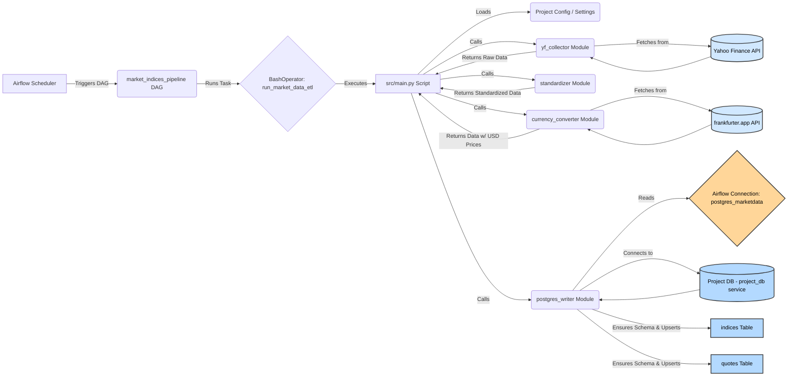

# Major World Market Indices Data Pipeline

## 1. Overview

This project implements a robust and automated data pipeline designed to collect, process, standardize, and store historical and near-real-time price data (Open, High, Low, Close, Adjusted Close, Volume) for major global stock market indices.

The primary goal is to create a reliable, centralized, and consistently formatted dataset suitable for financial analysis, quantitative modeling, backtesting trading strategies, or powering dashboards, thereby eliminating the tedious and error-prone process of manual data collection and cleaning.

The system leverages Python for data manipulation, PostgreSQL for persistent storage, and Apache Airflow (containerized using Docker Compose) for efficient orchestration, scheduling, and monitoring of the entire ETL (Extract, Transform, Load) process.

## 2. Motivation & Purpose

Manually gathering and maintaining consistent time-series data for multiple international market indices is challenging due to:
*   Varying data formats and naming conventions across sources.
*   Different time zones and trading hours.
*   Prices quoted in different currencies.
*   The need for regular updates to capture the latest market movements.

This project addresses these challenges by providing:
*   **Automation:** Scheduled data fetching removes manual effort.
*   **Standardization:** Ensures consistent data structure, naming, time zones (UTC), and a common currency (USD) across all indices.
*   **Centralization:** Stores all data in a readily accessible PostgreSQL database.
*   **Reliability:** Uses robust error handling, logging, and `UPSERT` logic for data integrity.
*   **Scalability:** Built with modular components and containerization, allowing for easier extension and deployment.

## 3. Features

*   **Comprehensive Data Collection:** Fetches OHLCV data for a configurable list of major world indices (e.g., S&P 500, DAX, Nikkei 225, FTSE 100, Shanghai Composite, etc.).
*   **Reliable Data Source:** Primarily utilizes the `yfinance` library to retrieve data from Yahoo Finance.
*   **Thorough Standardization:**
    *   **Timestamps:** Converts all timestamps to Coordinated Universal Time (UTC) (`timestamp_utc`).
    *   **Column Naming:** Enforces consistent snake\_case column names (e.g., `open`, `high`, `low`, `close`, `adjusted_close`, `volume`).
    *   **Currency Conversion:** Converts prices from their original source currency (EUR, GBP, JPY, etc.) into a target currency (default: USD) using daily exchange rates. Adds dedicated `_usd` columns (e.g., `open_usd`, `close_usd`).
*   **Efficient Storage:** Stores data in a relational PostgreSQL database:
    *   `indices` table: Stores static metadata for each index (name, country, currency, etc.).
    *   `quotes` table: Stores the time-series price and volume data.
    *   Uses `UPSERT` (INSERT ON CONFLICT) logic for idempotent and efficient insertion/updating of data, preventing duplicates based on `(ticker, timestamp_utc)`.
*   **Automated Orchestration:**
    *   Managed by Apache Airflow running within Docker containers.
    *   A pre-defined DAG (`market_indices_pipeline`) orchestrates the entire workflow.
    *   Default schedule runs the pipeline every 6 hours (configurable in the DAG).
*   **Modular Design:** Codebase organized into logical modules (`data_collection`, `data_processing`, `storage`) for better maintainability, testability, and readability.
*   **Containerized Environment:** The complete Airflow setup, including Redis, the Airflow metadata database, and the dedicated project database, is managed via Docker and Docker Compose for simplified setup, dependency management, and consistent deployments across different environments.

## 4. Architecture & Workflow

The pipeline follows a standard ETL process orchestrated by the Airflow DAG:

1.  **Scheduled Trigger:** Airflow Scheduler triggers the `market_indices_pipeline` DAG based on its schedule (`0 */6 * * *`).
2.  **Task Execution:** The DAG runs the `run_market_data_etl` task (a `BashOperator`).
3.  **Run `main.py`:** The task executes the primary Python script (`src/main.py`) inside an Airflow worker container.
4.  **Load Configuration (`settings.py`):** The script loads the list of indices (`config/indices.json`) and runtime settings. Database credentials are retrieved via Airflow Connections.
5.  **Fetch Raw Data (`yf_collector.py`):** Downloads the latest market data for the configured tickers using `yfinance`, respecting the `FETCH_PERIOD` and `FETCH_INTERVAL` settings. The raw data often includes source timezone information.
6.  **Standardize Data (`standardizer.py`):**
    *   Transforms the wide-format data (tickers as columns) into a long format (one row per ticker per timestamp).
    *   Renames columns (e.g., `Adj Close` -> `adjusted_close`).
    *   Converts the timestamp to UTC (`timestamp_utc`).
    *   Enriches the data with metadata (name, country, original currency) from the configuration.
7.  **Convert Currency (`currency_converter.py`):**
    *   Identifies unique date/currency pairs needing conversion.
    *   Fetches required daily exchange rates (Base Currency -> USD) using the free [frankfurter.app](https://www.frankfurter.app/) API.
    *   Calculates and adds new columns with prices converted to USD (e.g., `open_usd`, `high_usd`).
8.  **Database Interaction (`postgres_writer.py`):**
    *   Establishes a connection to the dedicated project PostgreSQL database (`project_db` service) using the configured Airflow Connection (`postgres_marketdata`).
    *   Ensures necessary tables (`indices`, `quotes`) exist (`CREATE TABLE IF NOT EXISTS`).
    *   Upserts index metadata into the `indices` table based on the ticker.
    *   Upserts the fetched and processed quote data into the `quotes` table, updating existing rows based on the `(ticker, timestamp_utc)` primary key.
9.  **Logging & Completion:** Logs the outcome of each step and the overall pipeline status.



## 5. Tech Stack

*   **Language:** Python 3.12+
*   **Core Libraries:**
    *   `pandas`: Data manipulation and analysis.
    *   `yfinance`: Fetching data from Yahoo Finance.
    *   `requests`: Making HTTP requests (for currency rates).
    *   `psycopg2` (or `psycopg2-binary`): PostgreSQL adapter for Python.
    *   `python-dotenv`: Loading environment variables (primarily for local testing outside Docker).
*   **Database:** PostgreSQL (v13 used in Docker setup)
*   **Orchestration:** Apache Airflow (v2.10.5 used in Docker setup) with CeleryExecutor.
*   **Messaging Queue:** Redis (for CeleryExecutor)
*   **Containerization:** Docker, Docker Compose
*   **Development:** Jupyter Lab (optional, for exploration in `notebooks/`)

## 6. Project Structure

```plaintext
Global-Market-Index-ETL/
├── airflow/
│   └── dags/
│       └── market_data_dag.py  # Airflow DAG definition
├── config/                     # Static configuration files for the pipeline
│   └── indices.json            # Index definitions (ticker, name, country, currency)
├── logs/                       # Airflow task logs (mounted from containers)
├── notebooks/                  # Jupyter notebooks for exploration, testing, analysis
│   └── 01_data_exploration.ipynb
├── src/                        # Core Python source code for the pipeline logic
│   ├── config/
│   │   └── settings.py         # Loads indices.json & environment variables, defines constants
│   ├── data_collection/
│   │   └── yf_collector.py     # Module to fetch data via yfinance
│   ├── data_processing/
│   │   ├── standardizer.py     # Module for data cleaning, standardization, UTC conversion
│   │   └── currency_converter.py # Module for currency conversion using external API
│   ├── storage/
│   │   └── postgres_writer.py  # Module for PostgreSQL interaction (connect, upserts)
│   ├── utils/                  # Utility functions (if any needed)
│   └── main.py                 # Main executable script orchestrating ETL steps
├── tests/                      # Directory for unit/integration tests (Future Work)
├── .env.example                # Example file for environment variables (local testing)
├── .gitignore                  # Specifies intentionally untracked files that Git should ignore
├── docker-compose.yaml         # Defines and configures the multi-container Docker application (Airflow, DBs, Redis)
├── Dockerfile                  # Instructions to build the custom Airflow image with project dependencies
├── LICENSE                     # Project license file (e.g., MIT)
├── README.md                   # This documentation file
└── requirements.txt            # Python dependencies for the pipeline
```

## 7. Configuration

Several parts of the pipeline are configurable:

*   **`config/indices.json`:**
    *   This file defines the list of indices to track. Each entry is a JSON object:
        *   `"name"`: Full, human-readable name (e.g., "S&P 500").
        *   `"ticker"`: The ticker symbol recognized by Yahoo Finance (e.g., `^GSPC`). **This is crucial for data fetching.**
        *   `"country"`: Associated country (metadata).
        *   `"exchange"`: Primary stock exchange (metadata).
        *   `"currency"`: The currency the index is originally quoted in (e.g., "USD", "EUR", "JPY"). This is used for currency conversion.
    *   To add/remove indices, simply modify this JSON file. Ensure ticker validity.

*   **`src/config/settings.py`:**
    *   Loads `indices.json`.
    *   Defines key operational parameters:
        *   `FETCH_PERIOD` / `FETCH_INTERVAL`: Control how much data `yfinance` attempts to download on each run (e.g., `7d` period with `60m` interval). The `UPSERT` logic in the database handles overlaps. Choose values appropriate for the 6-hour schedule to ensure data isn't missed.
        *   `TARGET_CURRENCY`: The currency to convert prices into (default: `USD`). Changing this would require schema adjustments (`_usd` column names) and code changes in `postgres_writer`.
        *   `TIMEZONE`: Target timezone for standardization (default: `UTC`).
        *   Database connection details are *defined* here but should be *overridden* by Airflow Connections in the Docker setup.

*   **`.env` File:**
    *   Used **primarily for local development/testing** outside the Docker/Airflow environment.
    *   Contains database credentials (`DB_USER`, `DB_PASSWORD`, etc.).
    *   **CRITICAL:** Do **NOT** commit sensitive credentials in `.env` (or any file) to Git. Ensure `.env` is listed in `.gitignore`. For the Docker setup, use Airflow Connections instead.

*   **Airflow Connections (Docker Setup):**
    *   The primary method for providing database credentials to the pipeline running in Docker. See Step 3 in the Setup section below.

*   **Airflow DAG (`airflow/dags/market_data_dag.py`):**
    *   `schedule`: Controls how often the pipeline runs (Cron expression, default `0 */6 * * *` is every 6 hours).
    *   `start_date`: Defines when the DAG becomes active.
    *   `catchup`: Set to `False` to prevent the DAG from running for past missed schedules.
    *   Paths (`PROJECT_ROOT_IN_CONTAINER`, etc.): Define where the project code exists *inside* the Airflow containers (must match volume mounts in `docker-compose.yaml`).

## 8. Setup and Installation (Docker & Airflow)

This project is designed to run within a Docker environment managed by Docker Compose.

**Prerequisites:**

*   **Git:** To clone the repository.
*   **Docker:** Install Docker Desktop (Windows/Mac) or Docker Engine (Linux). Ensure Docker is running.
*   **Docker Compose:** Typically included with Docker Desktop. Install separately if needed on Linux (`docker compose` command).

**Steps:**

1.  **Clone the Repository:**
    ```bash
    git clone https://github.com/0x22B9/Global-Market-Index-ETL.git
    cd Global-Market-Index-ETL
    ```

2.  **Review `docker-compose.yaml`:**
    *   Familiarize yourself with the services: `postgres` (Airflow DB), `redis`, `project_db` (Your data!), `airflow-webserver`, `airflow-scheduler`, `airflow-worker`, etc.
    *   **Project Database (`project_db`):** Note the default credentials (`market_user`/`market_password`) and database name (`market_data`). Note the host port mapping `5433:5432` (access from host via 5433).
    *   **Volume Mounts:** Verify the volume mount mapping your *local* project directory to `/opt/airflow/projects/Global-Market-Index-ETL` inside the Airflow containers. **Adjust the host-side path (e.g., `C:/...` or `/home/...`) if your project is cloned elsewhere.** Example:
        ```yaml
        volumes:
          # ... other volumes
          - /path/on/your/host/Global-Market-Index-ETL:/opt/airflow/projects/Global-Market-Index-ETL # Linux/Mac example
          # - C:/Users/YourUser/Projects/Global-Market-Index-ETL:/opt/airflow/projects/Global-Market-Index-ETL # Windows example
        ```

3.  **Configure Airflow Connection (CRITICAL):**
    *   Start the Airflow stack (next step).
    *   Access the Airflow UI: `http://localhost:8080` (Default login: `airflow` / `airflow`).
    *   Go to **Admin -> Connections**.
    *   Click **+ Add a new record**.
    *   Enter the following:
        *   **Conn Id:** `postgres_marketdata` (This ID is hardcoded in `postgres_writer.py`)
        *   **Conn Type:** `Postgres`
        *   **Host:** `project_db` (The service name defined in `docker-compose.yaml`)
        *   **Schema:** `market_data` (The `POSTGRES_DB` value for the `project_db` service)
        *   **Login:** `market_user` (The `POSTGRES_USER` for `project_db`)
        *   **Password:** `market_password` (The `POSTGRES_PASSWORD` for `project_db`)
        *   **Port:** `5432` (The internal port PostgreSQL runs on inside the `project_db` container)
    *   Click **Test**. It should show "Connection successfully tested".
    *   Click **Save**.

4.  **Build and Run Docker Compose:**
    *   Open a terminal in the project's root directory (`Global-Market-Index-ETL/`).
    *   Run the command:
        ```bash
        docker compose up --build -d
        ```
    *   `--build`: Builds the custom Airflow image defined in `Dockerfile` (installs Python packages from `requirements.txt`). Only necessary on the first run or after changing `Dockerfile`/`requirements.txt`.
    *   `-d`: Runs the containers in detached mode (background).
    *   The first launch might take a few minutes as images are downloaded/built and Airflow initializes its database.

5.  **Verify Docker Setup:**
    *   Check if all containers are running: `docker compose ps` (All should show 'running' or 'healthy').
    *   Confirm Airflow UI access: `http://localhost:8080`.
    *   (Optional) Connect to the project database from your host machine using a client like DBeaver, pgAdmin, or `psql`:
        *   Host: `localhost`
        *   Port: `5433` (the mapped port)
        *   Database: `market_data`
        *   User: `market_user`
        *   Password: `market_password`

## 9. Running the Pipeline

1.  **Access Airflow UI:** Go to `http://localhost:8080`.
2.  **Locate DAG:** Find `market_indices_pipeline` in the list of DAGs.
3.  **Activate DAG:** Toggle the `Paused` switch to `Unpaused` (it will turn light blue/green).
4.  **Execution:**
    *   **Scheduled:** The DAG will automatically run based on its schedule (next 00:00, 06:00, 12:00, or 18:00 UTC).
    *   **Manual:** To run immediately, click the "Play" icon (Trigger DAG) on the right side of the DAG row.
5.  **Monitor:**
    *   Click the DAG name to see the Grid view, showing past and current runs.
    *   Click on a specific run (the colored squares/circles) and then on the `run_market_data_etl` task instance.
    *   Select the "Logs" tab to view the live output and logs from the `src/main.py` script execution. Check here for errors.

## 10. Database Schema (`project_db`)

The project uses a dedicated PostgreSQL database (`market_data`) with the following main tables:

**1. `indices` Table:** Stores metadata for each tracked index.

```sql
-- Stores static information about each market index
CREATE TABLE IF NOT EXISTS indices (
    ticker VARCHAR(30) PRIMARY KEY,          -- Unique ticker symbol (e.g., '^GSPC'), used as the primary reference
    name VARCHAR(255) NOT NULL,             -- Full, descriptive name of the index (e.g., 'S&P 500')
    country VARCHAR(100),                   -- Associated country or region (metadata)
    exchange VARCHAR(100),                  -- Primary exchange where the index is listed (metadata)
    original_currency VARCHAR(3) NOT NULL,  -- Native currency of the index's quotes (e.g., 'USD', 'EUR', 'JPY')
    created_at TIMESTAMP WITH TIME ZONE DEFAULT CURRENT_TIMESTAMP, -- Timestamp when the index was first added to this table
    updated_at TIMESTAMP WITH TIME ZONE DEFAULT CURRENT_TIMESTAMP  -- Timestamp of the last modification to this index's metadata (auto-updated)
);
```

**2. `quotes` Table:** Stores the time-series OHLCV data, including converted USD values.

```sql
-- Stores the time-series price and volume data for each index
CREATE TABLE IF NOT EXISTS quotes (
    ticker VARCHAR(30) NOT NULL,               -- Foreign key referencing indices.ticker
    timestamp_utc TIMESTAMP WITH TIME ZONE NOT NULL, -- Timestamp of the quote, standardized to UTC
    open DOUBLE PRECISION,                      -- Opening price in the index's original_currency
    high DOUBLE PRECISION,                      -- Highest price in the index's original_currency
    low DOUBLE PRECISION,                       -- Lowest price in the index's original_currency
    close DOUBLE PRECISION,                     -- Closing price in the index's original_currency
    adjusted_close DOUBLE PRECISION,            -- Closing price adjusted for dividends and stock splits (original_currency)
    volume BIGINT,                              -- Trading volume (may be null for some indices)
    open_usd DOUBLE PRECISION,                  -- Opening price converted to USD using daily rate
    high_usd DOUBLE PRECISION,                  -- Highest price converted to USD using daily rate
    low_usd DOUBLE PRECISION,                   -- Lowest price converted to USD using daily rate
    close_usd DOUBLE PRECISION,                 -- Closing price converted to USD using daily rate
    adjusted_close_usd DOUBLE PRECISION,        -- Adjusted close price converted to USD using daily rate
    inserted_at TIMESTAMP WITH TIME ZONE DEFAULT CURRENT_TIMESTAMP, -- Timestamp when this specific quote row was inserted or last updated

    -- Ensures uniqueness for each ticker at a specific point in time
    PRIMARY KEY (ticker, timestamp_utc),

    -- Ensures data integrity by linking quotes to a valid index
    CONSTRAINT fk_ticker
        FOREIGN KEY(ticker)
        REFERENCES indices(ticker)
        ON DELETE RESTRICT                     -- Prevent deleting an index if quote data exists for it
        ON UPDATE CASCADE                      -- If ticker in 'indices' changes (rare), update here too
);
```

*(Note: A trigger `update_indices_modtime` is also automatically created by `postgres_writer.create_tables` to manage the `updated_at` column in the `indices` table.)*

## 11. Usage Examples (SQL)

Once the pipeline has run successfully, you can query the `project_db` database (connect via `localhost:5433` from your host) using SQL:

**Example 1: Get the 5 most recent data points for S&P 500 (USD Close)**

```sql
SELECT
    timestamp_utc,
    ticker,
    close_usd,
    volume
FROM quotes
WHERE ticker = '^GSPC' -- Use the correct ticker from indices.json
ORDER BY timestamp_utc DESC
LIMIT 5;
```

**Example 2: Get all DAX data (Original & USD) for a specific date**

```sql
SELECT
    timestamp_utc,
    ticker,
    open, high, low, close, -- Original EUR prices
    open_usd, high_usd, low_usd, close_usd -- Converted USD prices
FROM quotes
WHERE ticker = '^GDAXI'
  AND DATE(timestamp_utc) = '2023-10-25' -- Replace with desired date
ORDER BY timestamp_utc ASC;
```

**Example 3: Find all tracked indices and their original currencies**

```sql
SELECT
    ticker,
    name,
    original_currency
FROM indices
ORDER BY name;
```

## 12. Testing

*   **Module Self-Tests:** Most modules in `src/` have an `if __name__ == "__main__":` block. You can run these directly (if outside Docker and dependencies installed, or via `docker exec` into a container) to perform basic functional tests of that module. For example:
    ```bash
    # If dependencies are installed locally:
    python src/data_collection/yf_collector.py
    python src/data_processing/standardizer.py
    # ... etc.

    # Or via Docker (find a running worker container ID):
    docker exec -it <airflow-worker-container-id> bash
    # Inside container:
    cd /opt/airflow/projects/Global-Market-Index-ETL
    python src/storage/postgres_writer.py
    exit
    ```
*   **Formal Tests:** The `tests/` directory is reserved for more formal unit and integration tests using frameworks like `pytest`. These are currently marked as **Future Work**.

## 13. Data Quality & Limitations

*   **Data Source Dependency:** The accuracy and availability of data rely entirely on Yahoo Finance via the `yfinance` library. Occasional gaps, delays, or inaccuracies in the source data may occur.
*   **Currency Conversion Approximation:** The pipeline uses **daily** closing exchange rates (from frankfurter.app) to convert **intraday** (e.g., hourly) prices. This is an approximation, as true intraday FX rates fluctuate constantly. Obtaining reliable, free intraday FX data is difficult.
*   **Exchange Rate Availability:** The frankfurter.app API might not have rates for all possible currency pairs or dates (especially recent holidays/weekends, where it usually provides the last available rate). This can result in `NULL` values in the `_usd` columns for affected rows. Logs will indicate missing rates.
*   **API Rate Limits:** While generally permissive for this use case, both Yahoo Finance (indirectly via `yfinance`) and frankfurter.app may have unpublished rate limits. Excessive fetch frequency could potentially lead to temporary blocks.
*   **Data Completeness (`NaN`/`NULL`):** Some data points might be missing from the source (e.g., `volume` is often not provided for indices). These will appear as `NULL` values in the database. `yfinance` might also return `NaN` for missing price points during non-trading periods, which are also stored as `NULL`.

## 14. Troubleshooting

*   **Docker Compose Issues:**
    *   **Port Conflicts:** Errors like "port is already allocated". Check if another service is using port `8080` (Airflow UI) or `5433` (Project DB host mapping) on your machine. Stop the conflicting service or change the host-side port mapping in `docker-compose.yaml` (e.g., `"8081:8080"`).
    *   **Container Not Starting/Unhealthy:** Check logs: `docker compose logs <service-name>` (e.g., `docker compose logs airflow-scheduler`, `docker compose logs project_db`). Look for permission errors, configuration issues, or resource exhaustion.
    *   **Resource Limits:** Ensure Docker Desktop (or your Docker Engine) has sufficient Memory (>=4GB recommended) and CPU allocated.
*   **Airflow Issues:**
    *   **DAG Not Appearing:** Check `airflow-scheduler` logs (`docker compose logs airflow-scheduler`) for Python syntax errors or import errors in the DAG file. Ensure the `market_data_dag.py` file is correctly mounted into `/opt/airflow/dags` inside the container.
    *   **Task `run_market_data_etl` Fails:** Check the task logs *within the Airflow UI*. Look for Python tracebacks indicating the source of the error (e.g., `yfinance` error, database connection error, processing error).
    *   **Database Connection Error (from Task Log):**
        *   Verify the Airflow Connection `postgres_marketdata` is correctly configured (Host=`project_db`, Port=`5432`, correct credentials, Schema=`market_data`).
        *   Ensure the `project_db` container is running and healthy (`docker compose ps`).
*   **Pipeline Logic Errors:**
    *   **`yfinance` Errors:** Check task logs. May indicate invalid tickers, network issues, or temporary Yahoo Finance problems.
    *   **Currency Conversion Failures:** Check task logs. Could be frankfurter.app API downtime or missing rates. Logs should indicate which rates were missing.
    *   **Database Write Errors:** Check task logs. Could be constraint violations (less likely with UPSERT), permissions issues (check Airflow Connection user), or DB server issues (check `project_db` logs).

## 15. Deployment Considerations

*   **Development vs. Production:** The provided `docker-compose.yaml` is excellent for local development and testing. For a robust production environment, consider:
    *   **Managed Services:** Using cloud provider services like AWS MWAA, Google Cloud Composer, or Astronomer.io for Airflow hosting.
    *   **Managed Databases:** Using AWS RDS, Google Cloud SQL, or similar for PostgreSQL instead of running it in a container.
    *   **Resource Allocation:** Sizing compute resources (CPU/Memory) for Airflow components and the database appropriately based on load.
    *   **Networking:** Setting up proper network security (firewalls, VPCs).
    *   **Monitoring & Alerting:** Integrating more advanced monitoring (e.g., Prometheus, Grafana) and alerting (e.g., PagerDuty, Slack) for pipeline failures.
    *   **CI/CD:** Implementing automated testing and deployment pipelines.

## 16. Contributing

Contributions are welcome! Please follow these general guidelines:

1.  **Reporting Issues:** Use the GitHub Issues tracker to report bugs, suggest features, or ask questions. Provide as much detail as possible.
2.  **Pull Requests:**
    *   Fork the repository.
    *   Create a new branch for your feature or bug fix (`git checkout -b feature/my-new-feature`).
    *   Make your changes.
    *   Ensure your code adheres to basic PEP 8 style guidelines.
    *   Add tests if applicable (Future Work).
    *   Commit your changes (`git commit -am 'Add some feature'`).
    *   Push to your fork (`git push origin feature/my-new-feature`).
    *   Create a Pull Request back to the main repository.

## 17. License

This project is licensed under the MIT License - see the [LICENSE](LICENSE) file for details.

*This project is provided as-is, with no warranties. Use financial data responsibly and verify its accuracy before making any investment decisions.*
